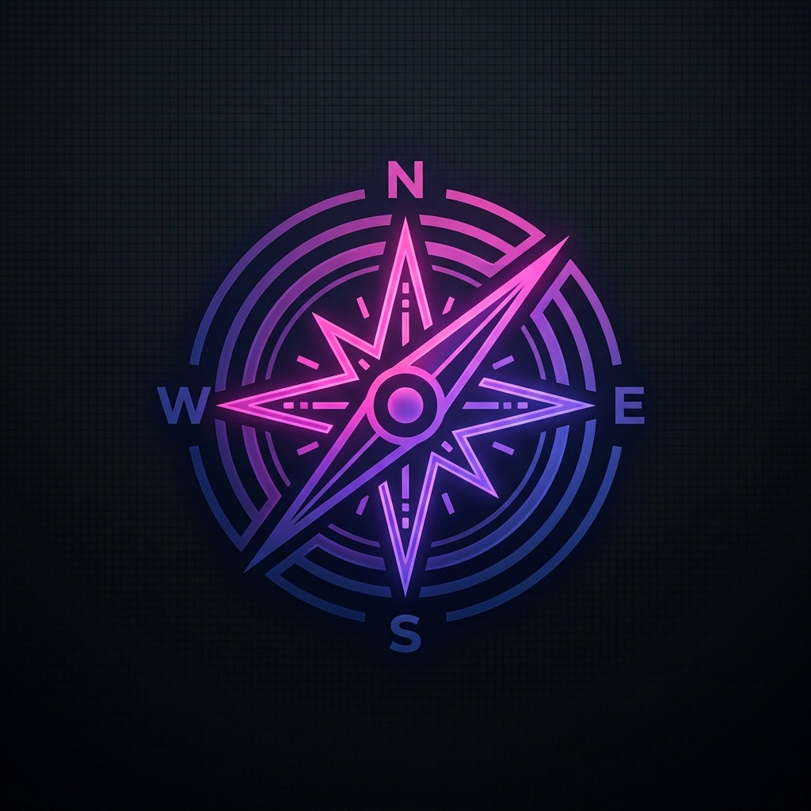

<p align="center">
  
</p>

<h1 align="center">Test Vocacional Interactivo 🎓</h1>

<p align="center">
  <strong>Descubre tu camino profesional a través de una experiencia interactiva y moderna.</strong>
</p>

<p align="center">
  <a href="#-sobre-el-proyecto">Proyecto</a> •
  <a href="#-características">Características</a> •
  <a href="#-tecnologías">Tecnologías</a> •
  <a href="#-instalación-y-despliegue-local">Instalación</a> •
  <a href="#-áreas-vocacionales-evaluadas">Áreas Evaluadas</a>
</p>

---

## 🎯 Sobre el Proyecto

El **Test Vocacional Interactivo** es una aplicación web diseñada para ayudar a estudiantes y jóvenes a descubrir su orientación profesional. Basado en una metodología estandarizada de 80 actividades, el sistema evalúa las preferencias del usuario a través de una dinámica moderna estilo "Swipe Cards" (tipo Tinder), donde cada decisión suma puntos a áreas específicas de interés vocacional.

Al finalizar, el motor de cálculo matemático arroja los mejores emparejamientos y recomienda áreas profesionales y carreras afines de manera precisa.

## ✨ Características

- **Interfaz Moderna y Dinámica**: Animaciones fluidas de arrastre (*swipe*) con soporte táctil para móviles y ratón en escritorio.
- **Motor de Cálculo Preciso**: Lógica matemática que procesa 80 actividades divididas equitativamente en 5 grandes áreas de estudio (16 por área).
- **Gestión de Empates**: Soporte inteligente para detectar múltiples áreas en primer y segundo lugar en caso de poseer afinidades vocacionales múltiples.
- **Arquitectura Resiliente**: Control estricto de caché para garantizar una evaluación limpia y una sesión inmutable en cada intento.
- **Diseño Premium**: Interfaz en Modo Oscuro elegante, utilizando fondos profundos, tipografía moderna y elementos interactivos que mejoran el enganche.

## 💻 Tecnologías

Este proyecto está construido siguiendo principios sólidos de arquitectura de software y separación de intereses:

- **Backend**: C# 13, .NET 10, ASP.NET Core MVC.
- **Base de Datos**: Entity Framework Core con SQLite (para desarrollo local) y diseñado para PostgreSQL (para producción).
- **Frontend**: Vanilla JavaScript (ES6+), CSS3 moderno, HTML5 Semántico.
- **Arquitectura**: Enfoque de Clean Architecture separando responsabilidades en capas lógicas (`Core`, `Data` y `Web`).
- **Pruebas Automatizadas**: MSTest para verificar el motor de cálculo y las reglas de empate.

## 🚀 Instalación y Despliegue Local

### Prerrequisitos

- [.NET SDK 10.0](https://dotnet.microsoft.com/download) o superior.
- Git.

### Pasos

1. **Clonar el repositorio**
   ```bash
   git clone https://github.com/CamiloThisPunk/Carreer-Guidance.git
   cd Carreer-Guidance
   ```

2. **Compilar el proyecto**
   ```bash
   dotnet build src/Web
   ```

3. **Ejecutar la aplicación**
   *La base de datos SQLite se creará y se poblará automáticamente con las 80 preguntas al iniciar.*
   ```bash
   dotnet run --project src/Web
   ```

4. **Probar el sistema**
   Abre tu navegador web e ingresa a: [http://localhost:5050](http://localhost:5050)

## 📊 Áreas Vocacionales Evaluadas

1. 🎨 **Arte y Creatividad** (Diseño, Música, Artes plásticas, Medios audiovisuales).
2. 👥 **Ciencias Sociales** (Psicología, Derecho, Educación, Periodismo, Sociología).
3. 📈 **Económica, Administrativa y Financiera** (Marketing, Contabilidad, Gestión, Comercio).
4. 💻 **Ciencia y Tecnología** (Ingenierías, Geología, Arquitectura, Desarrollo de Software).
5. 🧬 **Ciencias Ecológicas, Biológicas y de la Salud** (Medicina, Biología, Veterinaria, Nutrición).

---
<p align="center">
  <i>Construido para orientar el futuro del talento joven.</i>
</p>
